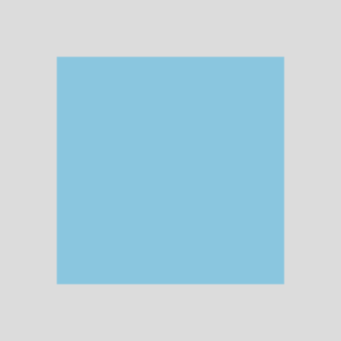
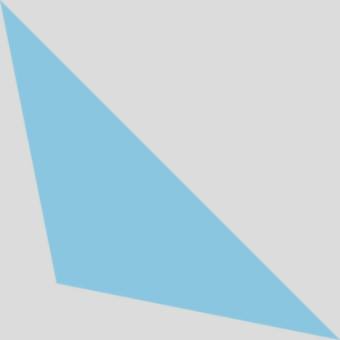
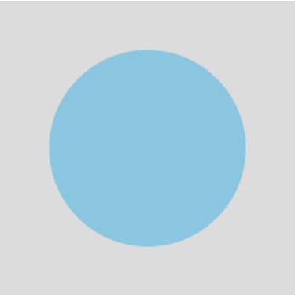
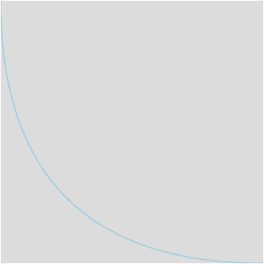
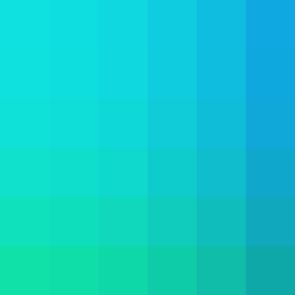

# Canvas Markdown Docs

## Canvas 元素

> ```html
> <canvas id="canvasHere" width="300px" height="300px">替代文本</canvas>
> ```
>
> Canvas元素拥有三个属性。
>
> - ID，用于DOM操作Canvas元素。
> - width，height，用于定义Canvas元素的大小。
>
> *使用CSS定义Canvas元素的宽高将导致Canvas元素**按照比例缩放**。* 
>
> *当浏览器不支持Canvas元素时，将显示定义在Canvas元素内部的替代文本。*

------

## Canvas格式

> 绘制Canvas元素之前，需要获取Canvas元素的上下文。
>
> ```js
>     // Set Up Canvans
>     let canvans = document.getElementById("canvasHere");
>     let ctx = canvans.getContext("2d");
> ```
>
> 检测浏览器对Canvas元素的支持性。
>
> ```js
> if (!canvans.getContext) return;
> ```

------

## Canvas绘制

### 绘制矩形

> 创建2D Canvas元素后，我们对于Canvas栅格的操作均位于平面直角坐标系之上。
>
> 绘制的起始点位于坐标原点。通过`fillRect`等方法，可以在指定位置绘制指定矩形。
>
> ```js
> ctx.fillRect(x, y, width, height)    	//绘制填充矩形
> ctx.strokeRect(x, y, width, height)		//绘制矩形边框
> ctx.clearRect(x, y, width, height)	    //绘制透明矩形(抹除)
> ```
>
> `X,Y`用于定义绘制矩形起始的坐标点。
>
> `Width,Height`用于定义矩形的宽度，高度。
>
> #### Example
>
> ```js
> ctx.fillRect(50, 50, 200, 200);
> ```
>
> 在*300x300*的画布中央绘制正方形。
>
> 

------

### 绘制线段

> 原生Canvas只提供了对绘制矩形的支持。绘制更复杂的图形，可以通过绘制路径实现。
>
> 通过路径绘制图形通常有以下几个步骤：
>
> 1. 定义起始坐标
> 2. 绘制路径
> 3. 封闭路径
> 4. 填充封闭路径
>
> ```js
> function definePath(x, y, toX, toY, endX, endY) {
>     ctx.beginPath();		 //定义路径
>     ctx.moveTo(x,y);		 //定义起始坐标
>     ctx.lineTo(toX,toY);	 //以坐标为终点绘制路径
>     // --- 此处可继续定义路径 --- 
>     ctx.closePath(endX,endY)  //闭合路径
>     ctx.stroke();			 //路径描边
>     ctx.fill();				 //填充路径
> }
> ```
>
> #### Exmaple
>
> ```js
> ctx.beginPath();
> ctx.moveTo(0, 0);
> ctx.lineTo(50, 250);
> ctx.lineTo(300, 300);
> ctx.closePath();
> //ctx.stroke();
> ctx.fill();
> ```
>
> 绘制一个三角形。
>
> 

------

### 绘制曲线

> 使用`arc()`方法可以绘制圆弧。
>
> ```js
> arc(x,y,r,startAngle,endAngle,anticlockwise);
> ```
>
> - `x,y` 定义圆弧的圆心
> - `r` 定义圆弧的半径
> - `startAngle,endAngle` 定义圆弧绘制的起始与终止弧度
> - `anticlockwise` 定义圆弧绘制的旋转方向
>
> 角度可以使用以下方式转换为弧度：
>
> ```js
> let rad = (Math.PI / 180) * deg;
> ```
>
> #### Example
>
> ```js
> let rad = Math.PI * 2
> ctx.beginPath();
> ctx.arc(150, 150, 100, 0, rad, false);	//绘制360°圆弧
> // ctx.stroke();
> ctx.fill();
> ```
>
> 绘制一个半径为100px的圆形。
>
> 
>
> ------
>
> 对于曲率变化较大的图形，Canvas给出了绘制 *贝塞尔曲线* 的方法。
>
> ```js
> quadraticCurveTo(cpx, cpy, endX, endY)
> ```
>
> ~~这玩意我真没法解释。~~
>
> `cpx,cpy` 定义控制点的坐标，影响绘制曲线的曲率。
>
> `endX,endY` 定义结束点的坐标。
>
> *一个贝塞尔曲线可以同时具有多个控制点。*
>
> 一次贝塞尔曲线：
>
> 
>
> 二次贝塞尔曲线：
>
> 
>
> 三次贝塞尔曲线：
>
> 
>
> ------
>
> #### Example
>
> ```js
> ctx.beginPath();       
> let cp1x = 0, cp1y = 300;	//定义控制点坐标
> let x = 300, y = 300;
> ctx.quadraticCurveTo(cp1x, cp1y, x, y)
> ctx.stroke();
> ```
>
> 绘制二次贝塞尔曲线：
>
> 

------

### 绘制样式

> 通过`fillStyle`和`strokeStyle`可以修改绘制图形的样式。
>
> ```js
> ctx.fillStyle = "rgba(55,175,225,0.5)";			//定义填充样式
> ctx.strokeStyle = "rgba(55,175,225,0.5)";		//定义描边样式
> ```
>
> #### Example
>
> ```js
> for (let i = 0; i < 6; i++) {
>     for (let j = 0; j < 6; j++) {
>         ctx.fillStyle = 'rgb(15,' + Math.floor(225 - 75 * i * i * 0.03) + ',' + Math.floor(225 - 75 * j * j * 0.03) + ')';		//定义填充样式算法
>         ctx.fillRect(i * 50, j * 50, 50, 50);
>     }
> }
> ```
>
> 绘制渐变图形：
>
> 

------

